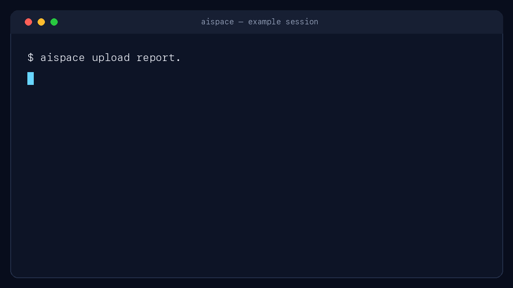

<p align="center">
  
</p>

<h1 align="center">aispace</h1>

<p align="center">
  <strong>Secure temporary file sharing for AI agents and humans.</strong><br>
  A scriptable CLI with expiring links, predictable JSON, and optional local age encryption.
</p>

<p align="center">
  <a href="https://aispace.sh">Website</a> ·
  <a href="https://aispace.sh/docs">Documentation</a>
</p>

<p align="center">
  <a href="https://github.com/aispace-sh/aispace-client/releases/latest"></a>
  <a href="https://github.com/aispace-sh/aispace-client/actions/workflows/ci.yml"></a>
  
  <a href="LICENSE"></a>
</p>

<p align="center">
  
</p>

[aispace.sh](https://aispace.sh) is a bot-friendly file drop for outputs that are too large,
structured, or temporary for chat. The open-source client is deliberately easy to automate: one
binary, stable exit codes, streaming uploads, and share URLs printed on a predictable final line.

- **Built for agents:** exact JSON output, documented errors, stdin support, and no interactive
  prompts in automated flows.
- **Short-lived by design:** file expiration, separately expiring links, revocation, and optional
  per-link download caps.
- **Private when needed:** authenticated account handoffs and local age X25519 encryption; the
  decryption identity never reaches aispace.

The hosted service is operated separately. This repository contains the client, agent skill, and
integration examples—not the server, billing system, deployment configuration, or customer data.

## Try it in 60 seconds

Install the latest release:

```sh
curl -fsSL https://aispace.sh/install.sh | sh
```

Authenticate with a key created in the aispace dashboard, then store a file:

```sh
aispace login --key ask_...
aispace upload report.pdf --json
```

On a Pro account, add a separately expiring public handoff:

```sh
aispace upload report.pdf --link --link-expires 1h --max-downloads 1
```

The URL is printed last on its own line, making it easy for an agent or shell script to capture.
Add `--json` for a stable machine-readable response. An abridged response looks like:

```json
{"file":{"id":"...","name":"report.pdf"},"link":{"url":"https://aispace.sh/d/...","expires_at":1757003600}}
```

Other installation channels:

```sh
npm install -g @aispace-sh/cli
brew install aispace-sh/tap/aispace
go install github.com/aispace-sh/aispace-client@latest
```

Pin the shell installer with `AISPACE_VERSION=v1.2.3`. Release binaries support macOS, Linux, and
Windows on amd64 and arm64. The shell installer supports macOS and Linux; use npm on Windows.

<div align="center">
  <a href="https://x.ai/bot/suv5xSPPbQmzi02LF7Z9Z">
    
  </a>
  <h3>Using Grok Bot?</h3>
  <p>Give Grok Bot a fast, bot-friendly way to share files with aispace.</p>
  <p>
    <a href="https://x.ai/bot/suv5xSPPbQmzi02LF7Z9Z"><strong>Add the aispace bot to Grok Bot →</strong></a>
  </p>
</div>

---

## Give aispace to an agent

The repository includes a reusable Codex-compatible skill. Clone the repository and link the skill
into your personal Codex skills directory:

```sh
git clone https://github.com/aispace-sh/aispace-client.git
mkdir -p ~/.codex/skills
ln -s "$PWD/aispace-client/skills/aispace" ~/.codex/skills/aispace
```

Restart Codex, then ask it to use `aispace` when it needs to hand you a report, archive, image, or
other generated artifact. The skill defaults to account-private storage unless you request a public
link, prefers short expirations, and treats encryption identities as credentials.

For custom agent runtimes, [`docs/LLM_USAGE.md`](docs/LLM_USAGE.md) includes a system-prompt snippet,
OpenAI/Anthropic-compatible tool schemas, and a reference Python handler. See [`examples`](examples)
for runnable shell, CI, and encrypted-handoff recipes.

## Common workflows

```sh
# Upload text from stdin and return an expiring public link (Pro).
echo "hello" | aispace upload - --name note.txt --link --link-expires 1h

# Keep a file available only to this key.
aispace upload secret.txt --private

# Share ciphertext; keep the generated age identity locally.
aispace upload secret.pdf --encrypt --identity-out secret.agekey --link

# Authenticated handoff to another key on the same account—no public URL.
aispace upload notes.md --shared --json

# Receive, manage, and revoke.
aispace ls --json
aispace download <file_id> --output ./file
aispace download <file_id> --output ./file --verify   # check the recorded SHA-256
aispace link <file_id> --expires 30m --max-downloads 1
aispace revoke <link_id>
aispace rm <file_id>
```

The complete command reference is in [`docs/CLI.md`](docs/CLI.md); the HTTP contract is in
[`docs/API.md`](docs/API.md).

`upload` accepts `--name`, `--expires`, `--content-type`, `--sha256`, `--link`, `--link-expires`,
`--max-downloads`, `--private`, `--shared`, `--encrypt`, `--recipient`, and `--identity-out`.
Uploads stream from disk. Encrypted uploads use age X25519 locally and store ciphertext as
`<name>.age`; the secret identity is never sent to the API.

With `--json`, errors also remain structured and are written to stderr. `upload --link --json`
returns `{"file": File, "link": ShareLink}`; encrypted uploads add an `"encryption"` object.

## Configuration

Precedence: flag > environment > config file > default.

| Setting | Flag | Env | File key | Default |
|---|---|---|---|---|
| API key | `--key` | `AISPACE_KEY` | `key` | — |
| Server | `--url` | `AISPACE_URL` | `url` | `https://aispace.sh` |

`AISPACE_AGE_IDENTITY` supplies a decryption identity when `decrypt --identity-file` is omitted.
It is deliberately not accepted as a command-line value.

Config file: `$XDG_CONFIG_HOME/aispace/config.json` (default `~/.config/aispace/config.json`), written with
mode 0600. A warning is printed if the file is readable by others. `AISPACE_CONFIG` overrides the path.

Durations (`--expires`, `--link-expires`) accept Go syntax plus a `d` suffix: `30m`, `24h`, `7d`, `1d12h`,
or a bare number of seconds. Omitting them uses the server defaults (7 days for files, 1 hour for links).

## File permissions and links

File visibility controls authenticated key access. A public link is a separate capability: creating
one requires a Pro account and makes that one file available to anyone holding the URL.

| File mode | Who can access it? | File lifetime | Public-link lifetime | Download cap | Exposure if access leaks |
|---|---|---|---|---|---|
| `private` | Uploading key only | 7 days by default; maximum 7 days on Free or 30 days on Pro | None | Account monthly limit | Private files belonging to that key, until deletion or expiry |
| `account` | Every active key on the account | 7 days by default; maximum 7 days on Free or 30 days on Pro | None | Account monthly limit | Account-shared files, until deletion or expiry |
| `private` + public link | Uploading key and anyone with the URL | Maximum 30 days because links require Pro | 1 hour by default; maximum 30 days and never beyond file expiry | Optional per-link cap | Only the linked file, until link expiry, revocation, exhaustion, file deletion, or file expiry |
| `account` + public link | Account keys and anyone with the URL | Maximum 30 days because links require Pro | 1 hour by default; maximum 30 days and never beyond file expiry | Optional per-link cap | URL access ends with the link; account keys retain access until file deletion or expiry |
| Client-encrypted file | Visibility controls ciphertext access; only age identity holders can decrypt it | Same limits as the selected file mode | Same Pro-only limits when a link is created | Optional per-link cap | Plaintext exposure requires both the ciphertext and the age identity |

Available duration syntax includes `30s`, `15m`, `1h`, `36h`, and `7d`.

A file becomes unavailable when its file lifetime ends. A link can end sooner because it expired,
was revoked, or reached its download cap. Deleting the file immediately ends authenticated key
access and every associated public link.

## Exit codes

| Code | Meaning |
|---|---|
| 0 | success |
| 1 | generic error (network, 4xx/5xx not listed below) |
| 2 | usage error |
| 3 | authentication (401, or no key configured) |
| 4 | quota / size (402, 413) |
| 5 | rate limited (429) — idempotent GETs sleep `Retry-After` (max 30s) and retry once |

Errors go to stderr as `error: <message> (<code>)`; with `--json` they are a JSON object
`{"error":{"code","message","status","details","exit_code"}}` on stderr instead.

## Development

```sh
go test -race ./... && go vet ./... && test -z "$(gofmt -l .)"
go build -ldflags "-X main.version=0.0.0-dev" -o aispace .
(cd npm && npm test && npm pack --dry-run)
```

The test suite uses local HTTP fixtures and does not require an aispace key. Contributions are
welcome—start with [`CONTRIBUTING.md`](CONTRIBUTING.md), check the [`ROADMAP.md`](ROADMAP.md), and
review the [`CHANGELOG.md`](CHANGELOG.md). Focused bug reports and feature proposals can use the
repository's structured issue forms.

Releases are cut through the manual GitHub Actions workflow. GoReleaser builds checksummed macOS,
Linux, and Windows binaries, updates the Homebrew tap, and publishes `@aispace-sh/cli` to npm. See
[`RELEASE.md`](RELEASE.md) for publisher configuration and the release checklist.

## Security

Please report vulnerabilities privately through GitHub Security Advisories. Do not open a public
issue containing a credential, private link, or customer data. See [`docs/SECURITY.md`](docs/SECURITY.md).
